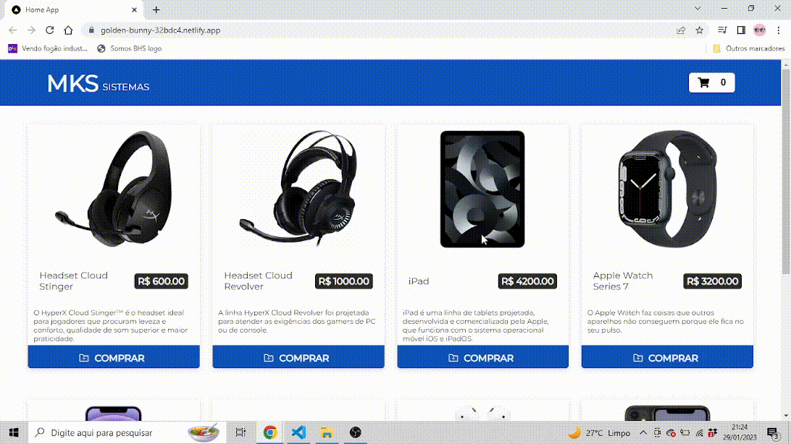

<h1 align="center">
  
</h1>

# Teste MKS

<p align="center">
  <a href="https://github.com/nataxaa">
    
  </a>

  <a href="#">
    
  </a>

  <a href="https://github.com/nataxaa/BarberShop/commits/master">
    
  </a>

  <a href="#">
    
  </a>

</p>

<br />

## 💻 Projeto

Projeto em Next de uma loja que adiciona os produtos ao carrinho de compras, podendo apagar, modificar a quantidade, cálculo total do valor e número de produtos no carrinho.
É utilizado axios para o consumo da api e redux toolkit para o compartilhamento de dados por toda a aplicação
<br />

## 🌐 Preview

<h1 align="center">
    
</h1>

## 🚀 Tecnologias

Esse projeto foi desenvolvido com as seguintes tecnologias:

- [Next](https://nextjs.org/)
- [Typescript](https://www.typescriptlang.org/)
- [Styled Components](https://styled-components.com/)
- [Axios](https://www.npmjs.com/package/axios)
- [Redux Toolkit](https://redux-toolkit.js.org/)

<br />

## 🔥 Instalação
```bash
$ npm
$ npm run dev
```
<br/>

## ⛅

- [Deploy](https://golden-bunny-32bdc4.netlify.app/)

<p align="center">
  Made with 💙 by <a href="https://www.linkedin.com/in/natan-xavier-a266a0228/"> Natan Xavier </a>
</p>

